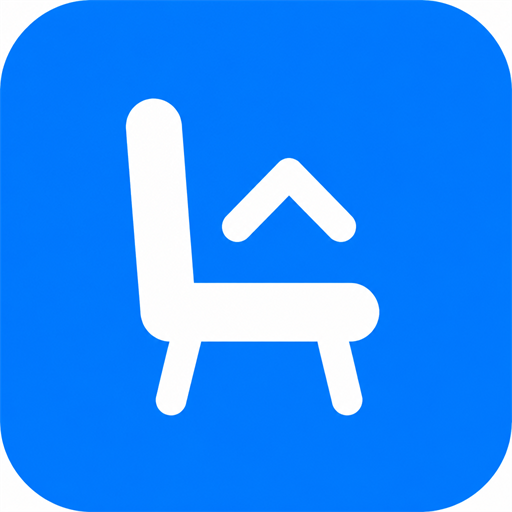
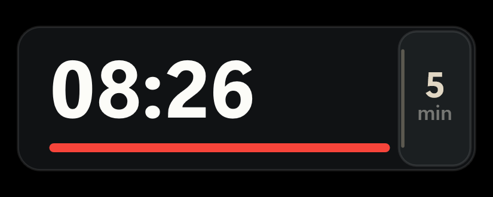
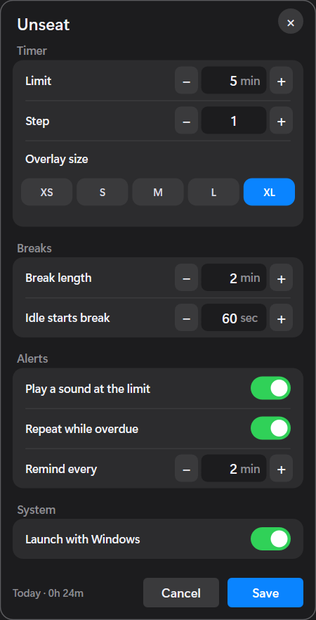

<p align="center">
  
</p>

<h1 align="center">Unseat</h1>

<p align="center">A local-only Windows break reminder. It sits on top of your work, tracks how long you have been at the desk, and nags you to get up.</p>

<p align="center">No accounts. No cloud. No telemetry.</p>

<p>
  <a href="LICENSE"></a>
  <a href="https://github.com/flyingsatoshi/unseat/actions"></a>
</p>

<p align="center">
  
</p>

<p align="center">
  
</p>

## What it does

- Always-on-top timer that starts when you launch it
- Idle or lock the session and it treats that as a break
- A qualifying break resets the current session
- Pause freezes the clock; reset starts a fresh session
- One alert at the limit, optional repeat while overdue
- Choose a bundled sound, preview it, and how long it plays
- Snooze from the overlay (click the overdue time), tray, or settings
- Tray icon, hover flyout, and a settings dialog
- Optional launch with Windows

Settings live in `%APPDATA%\Unseat\settings.json`.

See [ARCHITECTURE.md](ARCHITECTURE.md) for how the engine and Win32 host split.

## Install

Download `unseat.exe` from [Releases](https://github.com/flyingsatoshi/unseat/releases) and run it. The first launch copies Unseat into `%LOCALAPPDATA%\Unseat` and adds a Start Menu shortcut, so you can pin it to the taskbar and open it again without going back to Downloads.

Close from the taskbar or tray **Quit**. Click the pinned icon to open it again. Hide the overlay from the close chip or tray; the timer keeps running.

Optional: Settings → Launch with Windows.

## Alerts and snooze

Settings → Alerts picks **Chime**, **Bell**, **Pulse**, **Glass**, or **Soft**, with **Preview**. **Once** plays the clip; **2s / 4s / 8s** loops it for that long. Repeat reminders still fire on the interval you set.

When the sitting limit is reached, snooze **5 / 10 / 15 / 30** minutes or a custom duration. The last choice is saved. Click the overdue time on the overlay, or use the tray **Snooze** menu.

## Build from source

Windows 10/11 x64, [Rust](https://rustup.rs/), and the MSVC Build Tools C++ workload.

From an x64 Native Tools prompt (or after `vcvars64.bat`):

```bat
cargo test --no-default-features
cargo build --release --features gui
```

The binary is `target\release\unseat.exe`.

Library tests do not need the GUI feature. The Win32 host is behind `--features gui`.

To regenerate alert WAVs (optional):

```bat
python scripts\gen_sounds.py
```

## Privacy

Unseat never phones home. It does not upload usage, crash reports, or identity. Today’s total is stored only on this PC.

## License

[Apache License 2.0](LICENSE). Contributions are accepted under the same terms. Alert sounds in `assets/sounds/` are [CC0](assets/sounds/LICENSE.txt). See [NOTICE](NOTICE) for third-party crate notes.

**Unseat** is a name of this project. Forks may use the code; they should not present themselves as the official Unseat app.
